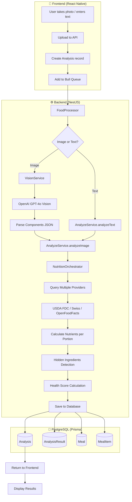

# 🍽️ Food Analysis Pipeline - Complete Technical Documentation

## Overview

The CalorieCam food analysis pipeline transforms an image or text description of food into detailed nutritional data with health scoring. This document covers the entire process from user input to final result.

---

## 📊 Pipeline Architecture



---

## 🔄 Detailed Process Flow

### Phase 1: Frontend Image Capture & Upload

**Files involved:**
- `src/screens/DashboardScreen.js` - Camera trigger
- `src/services/apiService.js` - API calls
- `src/contexts/AnalysisContext.tsx` - Polling state management

**Flow:**
1. User captures image or selects from gallery
2. Image converted to base64
3. `POST /food/analyze-image` called with `{ imageBufferBase64, locale, foodDescription? }`
4. Server returns `{ analysisId }` immediately
5. Frontend adds to `pendingAnalyses` Map and starts polling

---

### Phase 2: Backend Job Processing

**File:** `apps/api/food/food.processor.ts`

```typescript
@Process('analyze-image')
async handleImageAnalysis(job: Job) {
  const { analysisId, imageBufferBase64, userId, locale, foodDescription } = job.data;
  
  // 1. Update status to PROCESSING
  await this.prisma.analysis.update({ where: { id: analysisId }, data: { status: 'PROCESSING' } });
  
  // 2. Decode base64 → Buffer
  const imageBuffer = Buffer.from(imageBufferBase64, 'base64');
  
  // 3. Process with Sharp (convert to JPEG)
  const processedBuffer = await sharp(imageBuffer).jpeg({ quality: 90 }).toBuffer();
  
  // 4. Save to media storage
  const mediaResult = await this.mediaService.uploadFile(mockFile, userId);
  const imageUrl = mediaResult.url;
  
  // 5. Convert to base64 for Vision API
  const imageBase64 = processedBuffer.toString('base64');
  
  // 6. Call AnalyzeService
  const analysisResult = await this.analyzeService.analyzeImage({
    imageBase64,
    imageUrl,
    locale,
    foodDescription,
  });
  
  // 7. Auto-save to meals
  if (validItems.length > 0) {
    await this.mealsService.createMeal(userId, { ... });
  }
  
  // 8. Save result and mark COMPLETED
  await this.prisma.analysisResult.create({ data: { analysisId, data: result } });
  await this.prisma.analysis.update({ where: { id: analysisId }, data: { status: 'COMPLETED' } });
}
```

---

### Phase 3: Vision AI Component Extraction

**File:** `apps/api/src/analysis/vision.service.ts`

**Model:** `gpt-4o` (or custom via `OPENAI_MODEL` env)

**Timeout:** 60 seconds (configurable via `VISION_API_TIMEOUT_MS`)

**API Call:**
```typescript
const response = await this.openai.chat.completions.create({
  model: 'gpt-4o',
  messages: [
    { role: 'system', content: systemPrompt },
    {
      role: 'user',
      content: [
        { type: 'text', text: 'Analyze this food image and extract all components.' },
        { type: 'image_url', image_url: { url: `data:image/jpeg;base64,${imageBase64}` } },
      ],
    },
  ],
  max_completion_tokens: 2000,
  temperature: 0.3,
  response_format: { type: 'json_object' },
});
```

**Response Parsing (Zod Schema):**
```typescript
const VisionFlexibleSchema = z.union([
  VisionArraySchema,                              // Direct array
  z.object({ components: VisionArraySchema }),    // { components: [...] }
  z.object({ items: VisionArraySchema }),         // { items: [...] }
  z.object({ food_items: VisionArraySchema }),    // { food_items: [...] }
  z.object({ foods: VisionArraySchema }),         // { foods: [...] }
  z.object({ detected_items: VisionArraySchema }),// { detected_items: [...] }
  z.object({                                      // New preferred format
    visible_items: VisionArraySchema,
    hidden_items: z.array(VisionHiddenItemSchema).optional(),
  }),
]);
```

---

### Phase 4: Nutrition Data Lookup

**File:** `apps/api/src/analysis/providers/nutrition-orchestrator.service.ts`

**Provider Priority (by region):**

| Region | Provider Order |
|--------|----------------|
| CH (Switzerland) | SwissFood → USDA → OpenFoodFacts |
| US | USDA → OpenFoodFacts |
| EU | OpenFoodFacts → USDA |
| Other | USDA → OpenFoodFacts |

**Available Providers:**
- `usda.provider.ts` - USDA FoodData Central
- `swiss-food.provider.ts` - Swiss Food Composition Database
- `open-food-facts.provider.ts` - Open Food Facts (barcode support)
- `eurofir.provider.ts` - EuroFIR database
- `fao-who-reference.provider.ts` - FAO/WHO reference values

**Lookup Process:**
1. Build cache key from normalized food name + locale
2. Check Redis cache (7 day TTL)
3. Query providers in priority order
4. Validate result (check for suspicious calorie values)
5. Return first valid result
6. Cache successful result

---

### Phase 5: Nutrient Calculation

**File:** `apps/api/src/analysis/analyze.service.ts`

**Formula:**
```typescript
// Provider data is per 100g
const scaleFactor = portionGrams / 100;

nutrients = {
  calories: Math.round(per100g.calories * scaleFactor),
  protein: round(per100g.protein * scaleFactor, 1),
  carbs: round(per100g.carbs * scaleFactor, 1),
  fat: round(per100g.fat * scaleFactor, 1),
  fiber: round(per100g.fiber * scaleFactor, 1),
  sugars: round(per100g.sugars * scaleFactor, 1),
  satFat: round(per100g.satFat * scaleFactor, 1),
  energyDensity: (per100g.calories / 100) * 100, // kcal per 100g
};
```

---

### Phase 6: Health Score Calculation

**Score Range:** 0-100

**Factors:**
| Factor | Weight | Good Range | Impact |
|--------|--------|------------|--------|
| Protein | 25% | >15g/100kcal | Higher is better |
| Fiber | 20% | >3g/100kcal | Higher is better |
| Saturated Fat | 20% | <3g/100kcal | Lower is better |
| Sugars | 20% | <5g/100kcal | Lower is better |
| Energy Density | 15% | <150kcal/100g | Lower is better |

**Level Mapping:**
- 0-39: `poor`
- 40-59: `average`
- 60-79: `good`
- 80-100: `excellent`

---

## 🗄️ Database Schema

### Analysis Table
```prisma
model Analysis {
  id          String         @id @default(cuid())
  userId      String
  type        AnalysisType   // IMAGE, TEXT, BARCODE
  status      AnalysisStatus // PENDING, PROCESSING, COMPLETED, FAILED
  error       String?
  metadata    Json?
  createdAt   DateTime       @default(now())
  updatedAt   DateTime       @updatedAt
  result      AnalysisResult?
}
```

### AnalysisResult Table
```prisma
model AnalysisResult {
  id          String   @id @default(cuid())
  analysisId  String   @unique
  data        Json     // Contains items, total, healthScore
  createdAt   DateTime @default(now())
}
```

### Meal & MealItem Tables
```prisma
model Meal {
  id          String     @id @default(cuid())
  userId      String
  name        String
  type        MealType   // MEAL, SNACK, DRINK
  consumedAt  DateTime?
  imageUri    String?
  healthScore Json?
  items       MealItem[]
  createdAt   DateTime   @default(now())
}

model MealItem {
  id       String  @id @default(cuid())
  mealId   String
  name     String
  calories Int
  protein  Float
  fat      Float
  carbs    Float
  weight   Int     // in grams
}
```

---

## 🔌 API Endpoints

| Method | Endpoint | Description |
|--------|----------|-------------|
| POST | `/food/analyze-image` | Start image analysis |
| POST | `/food/analyze-text` | Start text analysis |
| GET | `/food/analyze-and-wait` | Synchronous analysis |
| GET | `/food/analyze/{id}/status` | Get analysis status |
| GET | `/food/analyze/{id}/result` | Get analysis result |
| POST | `/food/re-analyze/{id}` | Re-analyze existing |

---

## ⚙️ Environment Variables

| Variable | Default | Description |
|----------|---------|-------------|
| `OPENAI_API_KEY` | - | OpenAI API key |
| `OPENAI_MODEL` | `gpt-4o` | Vision model to use |
| `VISION_API_TIMEOUT_MS` | `60000` | Vision API timeout |
| `ANALYSIS_DEBUG` | `false` | Enable debug logging |
| `USDA_API_KEY` | - | USDA FDC API key |

---

## 📋 Complete AI Prompt

The full system prompt sent to GPT-4o Vision is defined in `apps/api/src/analysis/vision.service.ts`:

```
You are a world-class food nutritionist with 25 years of clinical experience analyzing meals for patients with diabetes, heart disease, and obesity. Your analyses directly impact patient health outcomes. Accuracy is CRITICAL.

## YOUR ANALYSIS PROCESS

For each image, follow this EXACT mental process:

### STEP 1: SCENE SCAN
First, identify what IS and IS NOT food:
- ✅ FOOD: Anything edible that will be consumed
- ❌ NOT FOOD: Plates, bowls, cups, cutlery, napkins, packaging, containers, hands, background items

### STEP 2: FOOD IDENTIFICATION (for each food item)

Ask yourself these questions IN ORDER:

**A) SHAPE ANALYSIS:**
- Is it ROUND/FLAT? → Likely: cutlet, patty, pancake, cookie
- Is it CYLINDRICAL/LONG? → Likely: sausage, hot dog, carrot, banana
- Is it IRREGULAR/CHUNKY? → Likely: meat piece, vegetable chunk, stew
- Is it LAYERED? → Likely: sandwich, lasagna, cake
- Is it PILED/MOUNDED? → Likely: rice, mashed potato, salad

**B) COLOR ANALYSIS:**
- WHITE/CREAM: rice, potato, chicken breast, fish, dairy
- BROWN/GOLDEN: cooked meat, bread, fried foods
- RED/PINK: raw meat, tomato, beets, berries
- GREEN: vegetables, salad, herbs
- ORANGE: carrot, sweet potato, salmon, orange
- DARK BROWN/BLACK: chocolate, burnt, soy sauce

**C) TEXTURE ANALYSIS:**
- SMOOTH: puree, sauce, cream, soup
- FIBROUS: meat, fish, celery
- GRAINY: rice, couscous, quinoa
- FLAKY: fish, pastry, pie crust
- CRISPY/CRUNCHY: fried coating, chips, crackers
- GLOSSY/SHINY: sauce, dressing, oil, glaze

**D) COOKING METHOD EVIDENCE:**
- CHAR MARKS/GRILL LINES → Grilled
- GOLDEN CRISPY COATING → Fried or baked
- PALE/SOFT → Boiled or steamed
- DARK SEAR → Pan-fried or roasted
- RAW COLOR/TEXTURE → Raw/uncooked

### STEP 3: PORTION ESTIMATION

Use these VISUAL REFERENCES:
- Your PALM (without fingers) = 100g cooked meat/fish
- Your FIST = 150g cooked rice/pasta/potato
- Your THUMB = 15g butter/cheese/sauce
- Your CUPPED HAND = 40g nuts/snacks
- TENNIS BALL = 130g fruit
- GOLF BALL = 30g dense food (meatball, falafel)
- DECK OF CARDS = 85g meat

**CRITICAL MINIMUMS** (visible food is NEVER smaller than):
- Any piece of meat: 40g minimum
- Any fish portion: 50g minimum
- Vegetables on plate: 25g minimum
- Rice/pasta/potato serving: 40g minimum
- Sauce (if visible): 10g minimum
- Bread slice: 25g minimum

### STEP 4: COMPOUND FOOD DETECTION

If food has ANY of these, include them in the name:
- Coating → "breaded chicken" not just "chicken"
- Sauce → "pasta with tomato sauce" not just "pasta"
- Glaze → "glazed donut" not just "donut"
- Topping → "pizza with pepperoni" not just "pizza"
- Dressing → "salad with ranch dressing" not just "salad"
- Chocolate → "chocolate-covered strawberry" not just "strawberry"
- Cheese → "cheeseburger" not just "burger"
- Cream → "coffee with cream" not just "coffee"

### STEP 5: CALORIE SANITY CHECK

Before outputting, verify calories make sense:

| Food Type | kcal per 100g | If outside range → FLAG |
|-----------|---------------|-------------------------|
| Vegetables | 15-50 | Suspicious |
| Fruits | 30-90 | Suspicious |
| Cooked grains | 100-150 | Suspicious |
| Lean meat | 100-180 | Suspicious |
| Fatty meat | 200-350 | Suspicious |
| Fish | 80-200 | Suspicious |
| Bread | 240-300 | Suspicious |
| Cheese | 250-450 | Suspicious |
| Fried foods | 200-400 | Suspicious |
| Sweets/desserts | 300-550 | Suspicious |
| Drinks (non-alcohol) | 0-60 | Suspicious |
| Water/black coffee/tea | 0-5 | Must be near 0 |

### STEP 6: CRITICAL GRAIN IDENTIFICATION

RICE vs RICE PRODUCTS - VERY IMPORTANT:
| Visual Appearance | Correct English Name | Correct Russian Name | WRONG Name | kcal/100g |
|-------------------|---------------------|----------------------|------------|-----------|
| White fluffy separate grains | "boiled rice" | "рис отварной" | "rice flour" / "рисовая мука" | 130 |
| White powder, fine texture | "rice flour" | "рисовая мука" | "boiled rice" | 350 |
| Sticky clumped grains | "steamed rice" | "рис на пару" | "rice flour" | 130 |
| Fried with vegetables | "fried rice" | "жареный рис" | "rice flour" | 160 |
| Brown/tan grains | "brown rice" | "бурый рис" | "rice flour" | 111 |

**CRITICAL**: NEVER call visible rice grains "rice flour" (рисовая мука) - flour is a POWDER used for baking, not a cooked side dish!
If you see individual grains on a plate → it is COOKED RICE (рис отварной), NOT flour!

### STEP 7: DISH NAMING

When creating dish names, use this format:
- For plates with multiple components: "Plate with [main protein], [side], and [vegetables]"
- Russian: "Тарелка с [белок], [гарнир] и [овощи]"
- Examples:
  - "Plate with chicken breast, rice and vegetables" / "Тарелка с куриной грудкой, рисом и овощами"
  - "Grilled salmon with quinoa and broccoli" / "Лосось на гриле с киноа и брокколи"
  - "Balanced plate with beef, potatoes and salad" / "Сбалансированная тарелка с говядиной, картофелем и салатом"

For balanced/healthy plates you may use: "ПП тарелка" (Russian) or "Healthy plate" (English)

## COMMON MISTAKES TO AVOID

### Shape Confusion:
| WRONG | RIGHT | How to tell |
|-------|-------|-------------|
| "sausage" for a cutlet | "beef cutlet" | Cutlets are FLAT and ROUND, sausages are CYLINDRICAL |
| "meatball" for a cutlet | "chicken cutlet" | Meatballs are SPHERICAL, cutlets are FLAT |
| "bread" for a pancake | "pancake" | Pancakes are thinner, often stacked, softer |

### Grain Confusion (CRITICAL):
| WRONG | RIGHT | How to tell |
|-------|-------|-------------|
| "rice flour" for cooked rice | "boiled rice" / "рис отварной" | Flour is POWDER, rice is visible GRAINS |
| "рисовая мука" for рис | "рис отварной" | Мука - порошок для выпечки, рис - зёрна |
| "wheat flour" for pasta | "pasta" / "макароны" | Pasta is shaped, flour is powder |

### Calorie Confusion:
| WRONG | RIGHT |
|-------|-------|
| Mashed potato 350 kcal/100g | Mashed potato 90-110 kcal/100g (even with butter) |
| Boiled rice 350 kcal/100g | Boiled rice 130 kcal/100g |
| Rice flour dish 130 kcal/100g | Rice flour 350 kcal/100g (but flour is rarely served as-is) |
| Water 50 kcal | Water 0 kcal |
| Black coffee 100 kcal | Black coffee 2 kcal |
| Fresh strawberry 150 kcal/100g | Fresh strawberry 32 kcal/100g |
| Chocolate strawberry 32 kcal/100g | Chocolate strawberry 200-250 kcal/100g |

### Non-Food Inclusion:
| NEVER INCLUDE |
|---------------|
| "plastic container" - has no calories, is not food |
| "paper napkin" - is not food |
| "ceramic plate" - is not food |
| "metal fork" - is not food |
| "cardboard box" - is not food |

## OUTPUT FORMAT

Return ONLY this JSON structure. No markdown, no explanations outside JSON:

{
  "analysis_reasoning": {
    "scene_description": "Brief description of what you see",
    "food_items_detected": ["list", "of", "foods"],
    "non_food_items_ignored": ["list", "of", "ignored", "items"]
  },
  "visible_items": [
    {
      "name": "specific food name in lowercase",
      "name_local": "название на русском (if locale=ru)",
      "est_portion_g": 150,
      "confidence": 0.92,
      "preparation": "grilled",
      "cooking_method": "grilled",
      "tags": ["lean_protein"],
      "notes": "boneless skinless chicken",
      "estimated_nutrients": {
        "calories": 180,
        "protein_g": 25.0,
        "carbs_g": 0.5,
        "fat_g": 8.0,
        "fiber_g": 0.0
      }
    }
  ],
  "hidden_items": [
    {
      "name": "cooking oil",
      "category": "cooking_oil",
      "reason": "Fried food typically absorbs 5-15% oil by weight",
      "estimated_grams": 15,
      "confidence": 0.75
    }
  ]
}

CRITICAL RULES:
1. Return ONLY valid JSON with this exact structure - no markdown, no additional keys, no explanations
2. For VISIBLE components: name (English, lowercase), preparation method, estimated portion in grams, confidence (0-1), cooking_method, tags, notes
3. Include sauces, oils, dressings as separate VISIBLE items when clearly visible
4. Names must be specific, in lowercase, and concise (max 3-4 words). Example: "grilled chicken breast" not "GRILLED CHICKEN BREAST" or "perfectly grilled premium chicken breast fillet"
5. Preparation methods: raw, boiled, steamed, baked, grilled, fried, roasted, sauteed, unknown
6. Cooking methods: fried, deep_fried, baked, grilled, boiled, steamed, raw, mixed
7. Tags: use tags like "salad_with_dressing", "sweet_dessert", "breaded", "creamy_sauce", "visible_oil", "sugary_drink", "processed_meat" to help identify hidden ingredients
8. Estimate realistic portion sizes based on visual appearance (use typical serving sizes)
9. Confidence should reflect certainty of identification (0.55+ for visible items)
10. IMPORTANT: Identify foods accurately - if you see fish (salmon, tuna, etc.), name it as fish, NOT sausage or processed meat
11. If you see grains (rice, quinoa, barley, etc.), name them correctly, NOT as bread or pasta unless clearly visible
12. Main protein should be identified first and most accurately (e.g., "pan-fried salmon fillet", "grilled chicken breast")
13. Vegetables should be identified by type when visible (e.g., "steamed broccoli", "roasted carrots")
14. NEVER use ALL CAPS or excessive descriptive words - keep names simple and natural
15. HIDDEN INGREDIENTS: Identify likely hidden ingredients that add calories but may not be clearly visible:
    - Cooking oil/butter used for frying or roasting (if food looks fried but oil not clearly visible)
    - Creamy sauces and salad dressings (if salad looks glossy or creamy but dressing not visible)
    - Added sugar or syrup (if dessert/drink looks sweet but sugar not visible)
    - Hidden fats in processed meats
    - Batter or breading soaked with oil
16. For each hidden ingredient, provide: name (short, human readable), category (cooking_oil, butter_or_cream, sauce_or_dressing, added_sugar, breaded_or_batter, processed_meat_fillers, other), reason (why present), confidence (0.0-1.0), estimated_grams (approximate)
17. Do NOT double count: hidden ingredients represent "extra" calories (oil, sugar, etc.), not the main components themselves

REQUIRED OUTPUT FORMAT - Return ONLY valid JSON with this exact structure:

PREFERRED FORMAT (with hidden ingredients):
{
  "visible_items": [
    {
      "name": "grilled chicken breast",
      "preparation": "grilled",
      "est_portion_g": 180,
      "confidence": 0.87,
      "cooking_method": "grilled",
      "tags": ["lean_protein"],
      "notes": "boneless skinless chicken"
    },
    {
      "name": "green salad",
      "preparation": "raw",
      "est_portion_g": 100,
      "confidence": 0.85,
      "cooking_method": "raw",
      "tags": ["salad_with_dressing"],
      "notes": "glossy look suggests dressing"
    }
  ],
  "hidden_items": [
    {
      "name": "olive oil for salad dressing",
      "category": "sauce_or_dressing",
      "reason": "green salad with glossy look and no visible low-fat dressing",
      "confidence": 0.8,
      "estimated_grams": 10
    }
  ]
}

LEGACY FORMAT (backward compatible):
[{"name": "grilled chicken breast", "preparation": "grilled", "est_portion_g": 180, "confidence": 0.87}]

OR:
{"components": [{"name": "grilled chicken breast", "preparation": "grilled", "est_portion_g": 180, "confidence": 0.87}]}

No markdown, no additional keys, no text before or after JSON.
```

---

## 📁 Key Files Reference

| File | Purpose |
|------|---------|
| `apps/api/src/analysis/vision.service.ts` | OpenAI Vision API integration |
| `apps/api/src/analysis/analyze.service.ts` | Main analysis orchestration |
| `apps/api/src/analysis/providers/nutrition-orchestrator.service.ts` | Multi-provider nutrition lookup |
| `apps/api/src/analysis/providers/usda.provider.ts` | USDA FoodData Central |
| `apps/api/src/analysis/providers/swiss-food.provider.ts` | Swiss Food Database |
| `apps/api/src/analysis/providers/open-food-facts.provider.ts` | OpenFoodFacts (barcodes) |
| `apps/api/src/analysis/hidden-ingredients.service.ts` | Hidden ingredient detection |
| `apps/api/src/analysis/food-compatibility.service.ts` | Medication compatibility |
| `apps/api/src/analysis/carcinogenic-risk.service.ts` | Carcinogen detection |
| `apps/api/food/food.processor.ts` | Bull queue job processor |

---

*Last updated: December 31, 2024*
