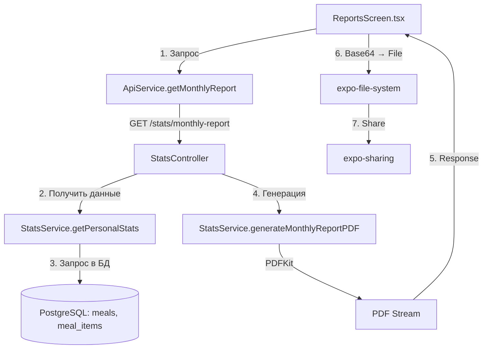

# 📊 PDF Reports Feature — Полное описание

Документ описывает функционал генерации ежемесячных PDF-отчетов о питании.

---

## Содержание
1. [Архитектура](#архитектура)
2. [Frontend (ReportsScreen)](#frontend-reportsscreen)
3. [Backend API](#backend-api)
4. [Генерация PDF (stats.service.ts)](#генерация-pdf)
5. [Структура отчета](#структура-отчета)
6. [Локализация](#локализация)
7. [Код ключевых компонентов](#код-ключевых-компонентов)

---

## Архитектура



### Файлы:

| Компонент | Путь |
|-----------|------|
| Frontend Screen | `src/screens/ReportsScreen.tsx` |
| API Service | `src/services/apiService.js` |
| Backend Controller | `apps/api/stats/stats.controller.ts` |
| Backend Service | `apps/api/stats/stats.service.ts` |
| Шрифты | `apps/api/assets/fonts/Roboto/static/` |

---

## Frontend (ReportsScreen)

**Путь:** `src/screens/ReportsScreen.tsx` (~560 строк)

### Основные функции:

1. **handleDownloadCurrentMonth()** — скачивает отчет за текущий месяц
2. **loadReportHistory()** — загружает историю из AsyncStorage
3. **saveReportToHistory()** — сохраняет отчет в историю (max 30 записей)
4. **handleOpenReport()** — открывает/шарит файл
5. **handleDeleteReport()** — удаляет из истории

### Состояния:

```typescript
const [loading, setLoading] = useState(false);
const [noData, setNoData] = useState(false);
const [history, setHistory] = useState<ReportHistoryItem[]>([]);

interface ReportHistoryItem {
  year: number;
  month: number;
  locale: string;
  fileUri: string;
  createdAt: string;
}
```

### Логика скачивания:

```typescript
// 1. Запрос к API
const response = await ApiService.getMonthlyReport({ year, month, locale });

// 2. Обработка ответа
if (response.status === 204) {
  setNoData(true); // Нет данных за месяц
  return;
}

// 3. Конвертация ArrayBuffer → Base64 (вручную, т.к. btoa недоступна в RN)
const uint8Array = new Uint8Array(response.data);
const chars = 'ABCDEFGHIJKLMNOPQRSTUVWXYZabcdefghijklmnopqrstuvwxyz0123456789+/';
let base64 = '';
// ... ручная конвертация ...

// 4. Сохранение в файл
const fileUri = `${documentDir}eatsense-monthly-report-${monthString}.pdf`;
await FileSystem.writeAsStringAsync(fileUri, base64Data, {
  encoding: FileSystem.EncodingType.Base64,
});

// 5. Шаринг
await Sharing.shareAsync(fileUri);
```

### UI экрана:

- **Заголовок** с описанием
- **Карточка "Monthly Report"** с кнопкой скачивания
- **История отчетов** (если есть) — список с кнопками Share / Delete

---

## Backend API

### Endpoint

```
GET /stats/monthly-report
```

**Query Parameters:**
| Параметр | Тип | По умолчанию | Описание |
|----------|-----|--------------|----------|
| year | number | текущий год | Год отчета |
| month | number | текущий месяц | Месяц (1-12) |
| locale | string | 'en' | Язык: 'en', 'ru', 'kk' |

**Responses:**
| Код | Описание |
|-----|----------|
| 200 | PDF файл (application/pdf) |
| 204 | Нет данных за месяц |
| 400 | Неверные параметры |
| 401 | Не авторизован |

### Controller (stats.controller.ts)

```typescript
@Get('monthly-report')
async getMonthlyReport(
  @Request() req: any,
  @Res() res: Response,
  @Query('year') yearParam?: string,
  @Query('month') monthParam?: string,
  @Query('locale') localeParam?: string,
) {
  const userId = req.user.id;
  
  // Парсинг и валидация параметров
  // ...
  
  const pdfStream = await this.statsService.generateMonthlyReportPDF(
    userId, year, month, locale
  );

  if (!pdfStream) {
    return res.status(204).send(); // No data
  }

  res.setHeader('Content-Type', 'application/pdf');
  res.setHeader('Content-Disposition', `attachment; filename="EatSense_Monthly_Report_${year}-${month}.pdf"`);
  
  pdfStream.pipe(res);
}
```

---

## Генерация PDF

**Метод:** `StatsService.generateMonthlyReportPDF()` (~750 строк)

**Библиотека:** [PDFKit](https://pdfkit.org/)

### Алгоритм:

1. **Получить данные** через `getPersonalStats()`
2. **Проверить наличие данных** (`totals.calories > 0` или `topFoods.length > 0`)
3. **Получить профиль пользователя**
4. **Создать PDF документ** (A4, margins 40px)
5. **Зарегистрировать шрифты** (Roboto, fallback на Helvetica)
6. **Отрисовать секции** (header, KPI, macros, top foods, conclusions)
7. **Вернуть Readable stream**

### Цветовая схема:

```typescript
const c = {
  primary: '#2563EB',   // Blue - Primary
  text: '#111827',      // Dark gray - Text
  muted: '#6B7280',     // Gray - Secondary text
  border: '#E5E7EB',    // Light gray - Borders
  success: '#059669',   // Green - Good values
  warning: '#D97706',   // Amber - Warning values
  danger: '#DC2626',    // Red - Bad values
  bg: '#F9FAFB',        // Light bg - KPI boxes
};
```

---

## Структура отчета

### Визуальный макет PDF:

```
┌─────────────────────────────────────────────────────────┐
│  EatSense                              Декабрь 2024     │
├─────────────────────────────────────────────────────────┤
│  Мужчина · 30 лет · 180 см · 80 кг                      │
│  Цель: 2400 ккал (Поддержать вес)                       │
├─────────────────────────────────────────────────────────┤
│ ┌──────────┐ ┌──────────┐ ┌──────────┐ ┌──────────┐     │
│ │  1,850   │ │  25/31   │ │   1.6    │ │  18/25   │     │
│ │  ккал    │ │          │ │          │ │          │     │
│ │ Средне/  │ │ Дней с   │ │ Белок    │ │ Дней в   │     │
│ │ день     │ │ данными  │ │ г/кг     │ │ норме    │     │
│ └──────────┘ └──────────┘ └──────────┘ └──────────┘     │
├─────────────────────────────────────────────────────────┤
│ ⚠️ Низкое покрытие дневника (5 из 31 дней)             │ <- только если < 7 дней
├─────────────────────────────────────────────────────────┤
│  МАКРОНУТРИЕНТЫ         │  ТОП-5 ПРОДУКТОВ              │
│  ████████████████████   │  1. Куриная грудка  4× 580ккал│
│  █ Б 25% █ У 45% █ Ж 30%│  2. Гречка          8× 340ккал│
│                         │  3. Творог 5%       6× 290ккал│
│  Среднее (25 дн.):      │  4. Яйца            12× 180ккал│
│  Б 95 · У 180 · Ж 65 г  │  5. Овсянка         5× 150ккал│
├─────────────────────────┴───────────────────────────────┤
│  РАСПРЕДЕЛЕНИЕ ПО ПРИЕМАМ ПИЩИ                          │
│  Завтрак  ████████████ 35%                              │
│  Обед     ██████████████████ 45%                        │
│  Ужин     ████████ 20%                                  │
├─────────────────────────────────────────────────────────┤
│  ВЫВОДЫ                                                 │
│  • Среднее: 1850 ккал/день (цель 2400 ккал, -550)       │
│  • Белок: 95 г/день (1.2 г/кг, 21% калорий)            │
├─────────────────────────────────────────────────────────┤
│  КАЧЕСТВО ДАННЫХ                                        │
│  Покрытие: 25/31 дней (81%)                             │
│  В коридоре ±10%: 18 из 25 дней (выше: 4, ниже: 3)     │
│  Диапазон: 1200 — 2800 ккал                             │
├─────────────────────────────────────────────────────────┤
│  ЕЖЕДНЕВНАЯ РАЗБИВКА                                    │
│  Дата      │ Калории │ Белок │ Углев │ Жиры           │
│  31.12     │  2,100  │  105  │  210  │  70            │
│  30.12     │  1,850  │   92  │  180  │  65            │
│  ...       │   ...   │  ...  │  ...  │  ...           │
├─────────────────────────────────────────────────────────┤
│  ──────────────────────────────────────────────         │
│  Сгенерировано 31.12.2024 в EatSense                    │
└─────────────────────────────────────────────────────────┘
```

### Секции отчета:

| # | Секция | Описание |
|---|--------|----------|
| 1 | **Header** | Логотип EatSense + период (месяц год) |
| 2 | **Profile** | Пол, возраст, рост, вес, цель калорий |
| 3 | **KPI Row** | 4 карточки: Avg kcal/day, Days logged, Protein g/kg, Days on track |
| 4 | **Warning** | Если < 7 дней данных — желтый баннер |
| 5 | **Macros** | Stacked bar (Б/У/Ж %) + легенда + средние г/день |
| 6 | **Top Foods** | Топ-5 продуктов с count × ккал × % |
| 7 | **Meal Distribution** | Horizontal bars по типам приема пищи |
| 8 | **Conclusions** | Автогенерируемые выводы с цифрами |
| 9 | **Data Quality** | Покрытие, коридор ±10%, min/max калорий |
| 10 | **Daily Breakdown** | Таблица по дням (если много данных) |
| 11 | **Footer** | Дата генерации |

---

## Локализация

Поддерживаемые языки: **en**, **ru**, **kk**

### Метод t() в stats.service.ts:

```typescript
t(locale: string, key: string, params?: Record<string, any>): string {
  const translations: Record<string, Record<string, string>> = {
    'profile.male': { en: 'Male', ru: 'Мужчина', kk: 'Ер' },
    'profile.female': { en: 'Female', ru: 'Женщина', kk: 'Әйел' },
    'goal': { en: 'Goal', ru: 'Цель', kk: 'Мақсат' },
    'kcal': { en: 'kcal', ru: 'ккал', kk: 'ккал' },
    'protein': { en: 'Protein', ru: 'Белки', kk: 'Ақуыз' },
    'carbs': { en: 'Carbs', ru: 'Углеводы', kk: 'Көмірсулар' },
    'fat': { en: 'Fat', ru: 'Жиры', kk: 'Май' },
    'macros': { en: 'Macronutrients', ru: 'Макронутриенты', kk: 'Макронутриенттер' },
    'topFoods': { en: 'Top Foods', ru: 'Топ продуктов', kk: 'Үздік тағамдар' },
    'mealDistribution': { en: 'Meal Distribution', ru: 'Распределение по приёмам', kk: 'Тамақ бөлінуі' },
    'conclusions.title': { en: 'Conclusions', ru: 'Выводы', kk: 'Қорытындылар' },
    'noData': { en: 'No data', ru: 'Нет данных', kk: 'Деректер жоқ' },
    // ... и другие
  };
  
  return translations[key]?.[locale] || translations[key]?.['en'] || key;
}
```

---

## Код ключевых компонентов

### 1. Frontend: ApiService.getMonthlyReport

**Путь:** `src/services/apiService.js` (строки 521-574)

```javascript
async getMonthlyReport(params = {}) {
  const { year, month, locale } = params;
  const queryParams = new URLSearchParams();

  if (year) queryParams.append('year', year.toString());
  if (month) queryParams.append('month', month.toString());
  if (locale) queryParams.append('locale', locale);

  const queryString = queryParams.toString();
  const endpoint = `/stats/monthly-report${queryString ? `?${queryString}` : ''}`;

  try {
    const response = await fetch(`${this.baseURL}${endpoint}`, {
      method: 'GET',
      headers: this.getHeaders(),
    });

    let data = null;
    if (response.status === 200) {
      try {
        data = await response.arrayBuffer();
      } catch (e) {
        // Fallback to blob
        const blob = await response.blob();
        data = blob._data || blob;
      }
    }

    return {
      status: response.status,
      ok: response.ok,
      headers: response.headers,
      data,
    };
  } catch (error) {
    console.error('[ApiService] getMonthlyReport error:', error);
    throw error;
  }
}
```

### 2. Backend: StatsController

**Путь:** `apps/api/stats/stats.controller.ts` (полный файл)

```typescript
import { Controller, Get, Query, UseGuards, Request, Res, BadRequestException } from '@nestjs/common';
import { ApiTags, ApiOperation, ApiResponse, ApiBearerAuth } from '@nestjs/swagger';
import { Response } from 'express';
import { JwtAuthGuard } from '../auth/guards/jwt-auth.guard';
import { StatsService } from './stats.service';

@ApiTags('Statistics')
@Controller('stats')
@UseGuards(JwtAuthGuard)
@ApiBearerAuth()
export class StatsController {
  constructor(private readonly statsService: StatsService) {}

  @Get('dashboard')
  async getDashboardStats(@Request() req: any) {
    return this.statsService.getDashboardStats(req.user.id);
  }

  @Get('nutrition')
  async getNutritionStats(@Request() req: any) {
    return this.statsService.getNutritionStats(req.user.id);
  }

  @Get('progress')
  async getProgressStats(@Request() req: any) {
    return this.statsService.getProgressStats(req.user.id);
  }

  @Get('monthly-report')
  @ApiOperation({ summary: 'Get monthly nutrition report as PDF' })
  @ApiResponse({ status: 200, description: 'PDF report generated successfully' })
  @ApiResponse({ status: 204, description: 'No data available for this month' })
  @ApiResponse({ status: 400, description: 'Invalid month parameter' })
  async getMonthlyReport(
    @Request() req: any,
    @Res() res: Response,
    @Query('year') yearParam?: string,
    @Query('month') monthParam?: string,
    @Query('locale') localeParam?: string,
  ) {
    const userId = req.user.id;
    const now = new Date();
    
    // Parse year and month
    let year: number;
    let month: number;
    
    if (yearParam && monthParam) {
      year = parseInt(yearParam, 10);
      month = parseInt(monthParam, 10);
      
      if (month < 1 || month > 12) {
        throw new BadRequestException('Invalid month: must be between 1 and 12');
      }
      if (year < 2020 || year > 2100) {
        throw new BadRequestException('Invalid year: must be between 2020 and 2100');
      }
    } else {
      year = now.getFullYear();
      month = now.getMonth() + 1;
    }

    const locale = localeParam || 'en';
    if (!['en', 'ru', 'kk'].includes(locale)) {
      throw new BadRequestException('Invalid locale: must be en, ru, or kk');
    }

    const pdfStream = await this.statsService.generateMonthlyReportPDF(userId, year, month, locale);

    if (!pdfStream) {
      return res.status(204).send();
    }

    const filename = `EatSense_Monthly_Report_${year}-${String(month).padStart(2, '0')}.pdf`;

    res.setHeader('Content-Type', 'application/pdf');
    res.setHeader('Content-Disposition', `attachment; filename="${filename}"`);

    pdfStream.pipe(res);
  }
}
```

### 3. Backend: getPersonalStats (данные для отчета)

**Путь:** `apps/api/stats/stats.service.ts` (строки 223-549)

**Возвращает:**

```typescript
{
  range: { from: string, to: string },
  totals: { entries: number, calories: number, protein: number, fat: number, carbs: number },
  average: { calories: number, protein: number, fat: number, carbs: number },
  goals: { calories: number },
  adherence: {
    percentage: number,
    status: 'over' | 'under' | 'on_track' | 'unknown',
    daysInRange: number,
    daysOver: number,
    daysUnder: number,
  },
  dataQuality: {
    loggedDays: number,
    totalDays: number,
    entriesPerDay: number,
    entriesCount: number,
  },
  nutrition: {
    proteinPerKg: number,
    minCalories: number,
    maxCalories: number,
  },
  conclusions: string[],
  topFoods: Array<{
    label: string,
    fdcId: string | null,
    count: number,
    totalCalories: number,
    averageCalories: number,
    totalQuantity: number,
    unit: string | null,
  }>,
  mealTypeDistribution: Array<{
    mealType: string,
    count: number,
    totalCalories: number,
    percentage: number,
  }>,
  dailyBreakdown: Array<{
    date: string,
    calories: number,
    protein: number,
    fat: number,
    carbs: number,
  }>,
  generatedAt: string,
}
```

### 4. Backend: generateMonthlyReportPDF (ключевая часть)

**Путь:** `apps/api/stats/stats.service.ts` (строки 551-1303)

```typescript
async generateMonthlyReportPDF(
  userId: string,
  year: number,
  month: number,
  locale: string = 'en',
): Promise<Readable | null> {
  try {
    const fromDate = new Date(year, month - 1, 1);
    const toDate = new Date(year, month, 0, 23, 59, 59, 999);

    // 1. Получить статистику
    const summary = await this.getPersonalStats(userId, fromDate.toISOString(), toDate.toISOString(), locale);

    // 2. Проверить наличие данных
    const hasData = summary.totals.calories > 0 || summary.topFoods?.length > 0;
    if (!hasData) {
      console.log(`[StatsService] No data for ${year}-${month}, user ${userId}`);
      return null;
    }

    // 3. Получить профиль
    const userProfile = await this.prisma.userProfile.findUnique({
      where: { userId },
      include: { user: true },
    });

    // 4. Создать PDF документ
    const doc = new PDFDocument({
      size: 'A4',
      margin: 40,
      autoFirstPage: true,
      bufferPages: false,
      info: {
        Title: `EatSense - ${this.getMonthName(locale, month)} ${year}`,
        Author: 'EatSense',
        Subject: 'Monthly Nutrition Report',
      },
    });

    // 5. Создать stream
    const stream = new Readable();
    stream._read = () => {};
    doc.on('data', (chunk) => stream.push(chunk));
    doc.on('end', () => stream.push(null));
    doc.on('error', (error) => stream.destroy(error));

    // 6. Регистрация шрифтов (Roboto)
    const fontsDir = path.join(process.cwd(), 'apps', 'api', 'assets', 'fonts', 'Roboto', 'static');
    try {
      doc.registerFont('Roboto', path.join(fontsDir, 'Roboto-Regular.ttf'));
      doc.registerFont('Roboto-Bold', path.join(fontsDir, 'Roboto-Bold.ttf'));
      doc.registerFont('Roboto-Light', path.join(fontsDir, 'Roboto-Light.ttf'));
    } catch (e) {
      console.warn('[StatsService] Font registration failed, using Helvetica');
    }

    // 7. Отрисовка секций PDF
    // ... (Header, KPI Row, Macros, Top Foods, Conclusions, Data Quality, Daily Table, Footer)
    
    doc.end();
    return stream;
  } catch (error) {
    console.error('[StatsService] Error generating PDF:', error);
    throw error;
  }
}
```

---

## Зависимости

### Frontend:
- `expo-file-system` — сохранение файлов
- `expo-sharing` — шаринг файлов
- `@react-native-async-storage/async-storage` — история отчетов

### Backend:
- `pdfkit` — генерация PDF
- Шрифты Roboto в `apps/api/assets/fonts/Roboto/static/`

---

## Возможные улучшения

1. **Графики трендов** — добавить линейный график калорий по дням
2. **Выбор периода** — произвольный период, не только месяц
3. **Email отправка** — отправка отчета на email
4. **Сравнение месяцев** — показать изменения vs прошлый месяц
5. **Экспорт в CSV** — альтернативный формат для анализа
6. **Кэширование PDF** — не генерировать повторно тот же отчет
